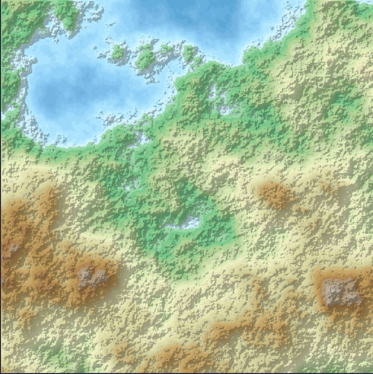

# proj_itp_terreno

Projeto da disciplina ITP para geração procedural de mapas de terrenos aleatórios em C++.

O programa gera um mapa de altitudes usando o algoritmo **Diamond-Square** e o converte em uma imagem colorida no formato PPM com sombreamento.



## Estrutura do projeto

```
src/
├── cor.h                        # estrutura Cor (RGB)
├── sequencia/
│   ├── sequencia.h              # sequência genérica (equivalente ao vector<>)
│   └── sequencia_testes.cpp
├── paleta/
│   ├── paleta.h / paleta.cpp    # paleta de cores lida de arquivo .hex
│   └── paleta_testes.cpp
├── imagem/
│   ├── imagem.h / imagem.cpp    # imagem com leitura/escrita PPM
│   └── imagem_testes.cpp
├── terreno/
│   ├── terreno.h / terreno.cpp  # geração do mapa de altitudes
│   └── terreno_testes.cpp
├── exemplo/
│   ├── exemplo.png              # exemplo de mapa gerado
│   ├── exemplo.ppm
│   └── matrizAltitude.r16
└── main/
    ├── main.cpp                 # programa principal
    ├── cores.hex                # paleta com 30 cores
    └── cores_60.hex             # paleta com 60 cores
```

## Compilação

Dentro da pasta `src/main/`, compile todos os arquivos necessários:

```bash
g++ main.cpp ../paleta/paleta.cpp ../imagem/imagem.cpp ../terreno/terreno.cpp -o gerador
```

## Como usar

Execute o programa e siga as instruções:

```bash
./gerador
```

O programa irá pedir:

- **Paleta de cores**: 30 ou 60 cores
- **Tamanho do mapa**: de 17×17 até 1025×1025
- **Semente**: número inteiro — a mesma semente sempre gera o mesmo terreno
- **Nome do arquivo de saída**: o mapa será salvo como `.ppm`

A imagem gerada pode ser visualizada com a extensão [PPM Viewer para VS Code](https://marketplace.visualstudio.com/items?itemName=ngtystr.ppm-pgm-viewer-for-vscode).

## Dependências

Biblioteca padrão do C++.
